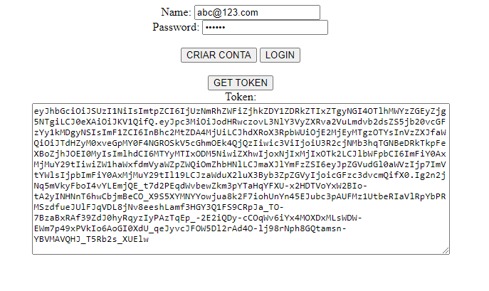
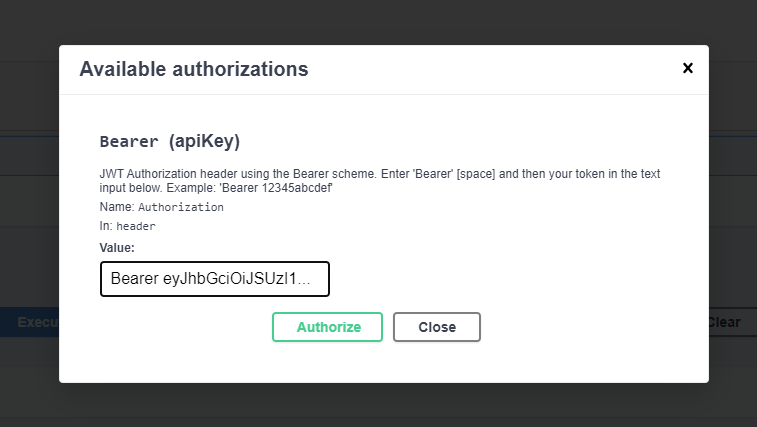
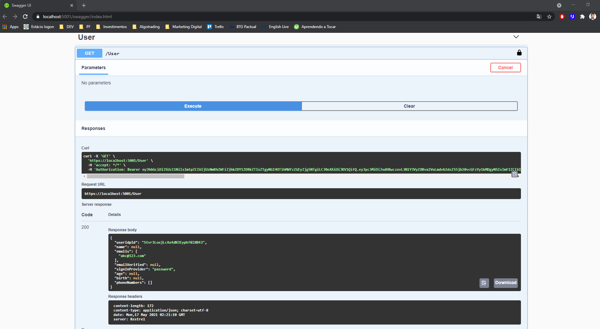

# PASC

Projeto da disciplina Engenharia de Software - UFRJ - 2020.2  
API feita em Asp.Net Core 3.1

## Instalando os componentes
Download & Install Visual Studio 2019 Community
```
https://visualstudio.microsoft.com/pt-br/downloads/
```
Download & Install Postgree (Para Windows 10 utilize a versão 10.x)  
Anote a senha que você colocar durante a instalação.  
Essa será a senha de administração do banco de dados na sua máquina.
```
https://www.enterprisedb.com/downloads/postgres-postgresql-downloads
```
Baixe algum client de Banco de dados Postgree  
Indico o Dbeaver:
```
https://dbeaver.io/download/
```

## Iniciando o banco de dados
* Abra o DBeaver, clique em conectar e selecione SQL > PostgreSQL.   
    Preencha com a senha de administração e clique em conectar.  
* Será necessário criar um usuário para a aplicação:  
    Botão direito em Roles > Create New Role  
    Usuário padrão de teste: pasc1  
    Senha padrão de teste: pasc1teste  
* Precisamos dar permissão de editar o banco ao usuário:  
    Dois cliques no usuário  
    Selecione a role "Super User" e clique em "save" na parte inferior  

Até aqui temos todos os programas instalados e usuário configurado.  
Agora faça um clone deste repositório:
```
git clone https://github.com/HeitorTomaz/PASC
```

## Front-End para testes
Criei uma tela apenas para testar login e facilitar a aquisição de Access Tokens.  
Para acessar basta abrir:
 ```
./Web-teste/index.html
```
<div align="center">
  <a href="https://github.com/HeitorTomaz/PASC">
    
  </a>
</div>

Você pode criar um novo usuário, logar com um usuário criado e exibir o token desse usuário.  
Lembre-se que o usuário ficará salvo na firebase após você clicar em "Criar Conta".  
Para inspecionar o token que foi gerado pode acessar o seguinte endereço e colar o token na caixa da esquerda:  
```
https://jwt.io/
```

## API
Abra o arquivo PASC.sln no Visual Studio  
Compile o projeto (Ctrl+Shift+B)  
Atualize a versão do banco de dados. Para isso, abra o Console do Gerenciador de Pacotes (Ferramentas > Gerenciador de pacotes do NuGet > Console do Gerenciador de Pacotes)  
Execute o comando:
```
update-database
```
No ícone de "Play" selecione "PascAPI" e execute.  
Quando a página abrir clique em Authorize na direita e preencha com o token gerado na página de testes.
<div align="center">
  <a href="https://github.com/HeitorTomaz/PASC">
    
  </a>
</div>
Agora você está autenticado na API (Logado)  
Execute alguma chamada para testar:
<div align="center">
  <a href="https://github.com/HeitorTomaz/PASC">
    
  </a>
</div>
